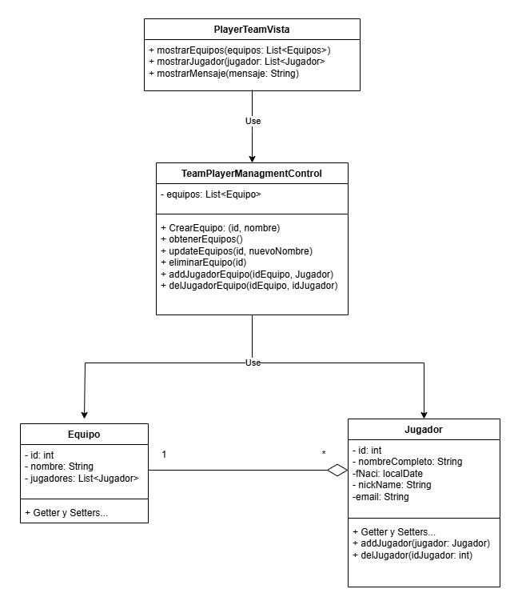

# Sistema de Gestión de Torneos de eSports

## Autor

José Ignacio Ribeiro Lucas  
https://github.com/Screvas

## Descripción del Proyecto  
https://github.com/Screvas/torneo-esports-uml

Este proyecto implementa un sistema de gestión de torneos de eSports
utilizando UML para el modelado y Java para la implementación.

¿Quiénes son los actores que interactúan con el sistema?
- Con el sistema solo interactuará los administradores encargados de gestionar los torneos.

¿Cuáles son las acciones que cada actor puede realizar?  
- Consultar lista de equipos y jugadores.  
**  Todos los jugadores guardados en base de datos.  **  
**  Todos los equipos con sus respectivos jugadores.  **  
- Registrar nuevo equipo.  

-  Añadir jugador a un equipo.  
** Añadir un jugador ya existente en base de datos. **   
** Crear un nuevo jugador y añadirlo al equipo correspondiente.  **  
- Eliminar jugador de un equipo.  

¿Cómo se relacionan entre sí las entidades del sistema?

En este sistema, la vista (TeamPlayerVista) se encarga de la interacción con el usuario, enviando las acciones al controlador (TeamPlayerController), que maneja la lógica del negocio.

El controlador se comunica con los modelos (Equipo y Jugador), que representan las entidades principales y definen su estructura. Los modelos gestionan la relación entre equipos y jugadores, donde un equipo puede tener múltiples jugadores.

El controlador actúa como el centro de operaciones, coordinando la comunicación entre las vistas y los modelos, y garantizando el cumplimiento de las reglas del sistema.

## Diagramas UML ##  

### Diagrama de Casos de Uso

### Diagrama de Clases

## Estructura del Proyecto

torneo-esports-uml/ ├── src/  
│ ├── es/empresa/torneo/  
│ │ ├── modelo/  
│ │ ├── control/  
│ │ ├── vista/  
│ │ ├── Main.java  
├── diagrams/  
│ ├── casos-uso.png  
│ ├── clases.png  
├── README.md  
├── .gitignore  

## Instalación y Ejecución  

1. Clonar el repositorio:  
`git clone https://github.com/Screvas/torneo-esports-uml.git`  
2. Compilar y ejecutar el proyecto:  
`cd src javac es/empresa/torneo/Main.java java es.empresa.torneo.Main`  

## Justificación del diseño  

He decidido organizar el diseño siguiendo la arquitectura MVC (Modelo-Vista-Controlador) para lograr una separación clara de responsabilidades:

Vista (TeamPlayerVista): se centra exclusivamente en la interacción con el usuario, permitiendo modificar la interfaz sin afectar la lógica interna.

Controlador (TeamPlayerController): gestiona la lógica del negocio y actúa como intermediario entre la vista y los modelos, asegurando que las operaciones respeten las reglas del sistema.

Modelos (Equipo y Jugador): representan las entidades principales del sistema, encapsulando su estructura y relaciones (un equipo puede tener varios jugadores).

Esta organización permite mantener un código limpio, mantenible y escalable, facilitando futuras ampliaciones como la incorporación de nuevas funcionalidades o el cambio en la forma de persistencia de datos, sin romper la lógica del sistema.  

## Conclusiones  

El desarrollo de este proyecto utilizando la arquitectura MVC me permitió comprender mejor la importancia de separar responsabilidades dentro de una aplicación:

Vista: se encarga de mostrar información y recoger acciones del usuario, sin incluir lógica de negocio.

Controlador: actúa como intermediario entre la vista y los modelos, aplicando las reglas del sistema.

Modelos: representan las entidades principales (Equipo y Jugador) y gestionan sus relaciones.

Diseñar el diagrama UML antes de programar me ayudó a visualizar claramente la estructura y relaciones entre clases, facilitando la planificación y la detección temprana de errores de diseño.  

